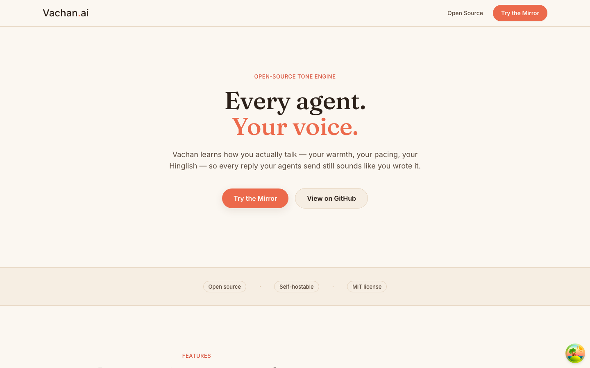

> Vachan (वचन) = *word · speech · a given promise.*

# Vachan.ai — Open-source tone engine. Every agent. Your voice.

Vachan.ai is an open-source tone engine. Capture how a specific person, brand, or team communicates, turn it into a portable, versioned **Persona Capsule**, and mount that voice onto **any AI agent, on any channel**. The agent decides *what* to say; the capsule decides *how* it sounds.



---

## Quick start

The fastest way to run the backend services locally:

```bash
docker compose up -d
```

This starts Postgres (with pgvector) and Redis. Then follow the backend and frontend setup below.

## Local development setup

### Backend

```bash
cd backend
python3 -m venv .venv
./.venv/bin/pip install -r requirements.txt
./.venv/bin/python -m spacy download en_core_web_sm   # PII NER model
./.venv/bin/alembic upgrade head
./.venv/bin/uvicorn app.main:app --reload --port 8000
```

Verify: `curl http://127.0.0.1:8000/health`

### Frontend

```bash
cd frontend
npm install
cp .env.example .env.local
npm run dev
```

Open `http://localhost:3000`.

### Environment

- Copy `.env.example` to `.env` in the repo root.
- Local dev works without API keys.
- Set `ANTHROPIC_API_KEY`, `GROQ_API_KEY`, etc. when you want live LLM features.

See [`backend/README.md`](backend/README.md) for auth, the message pipeline, and reset commands.

---

## Project structure

```
Vachan.ai/
├── backend/          # FastAPI + async SQLAlchemy + Postgres/pgvector + Redis
├── frontend/         # Next.js App Router + Tailwind v4 + shadcn/ui
├── docs/             # Architecture, product, and build wiki
├── experiments/      # Research spikes (control vectors, etc.)
├── tools/            # Helper utilities
├── docker-compose.yml
└── LICENSE
```

---

## Architecture

Vachan.ai separates **what** to say (domain agent) from **how** to say it (persona renderer). A channel adapter normalizes inbound messages, the orchestration layer routes them, and a Persona Capsule steers the final reply before it reaches the user.

Read the full architecture in [`docs/02_ARCHITECTURE.md`](docs/02_ARCHITECTURE.md) and the tech stack in [`docs/04_TECH_STACK.md`](docs/04_TECH_STACK.md).

---

## Contributing

We welcome issues, bug fixes, and ideas. Please read [`CONTRIBUTING.md`](CONTRIBUTING.md) for setup, branch naming, commit style, tests, and the pull request process.

## License

This project is licensed under the [MIT License](LICENSE).

Copyright (c) 2026 Abhishek Sharma.

---

Made in India, for how India actually talks.
