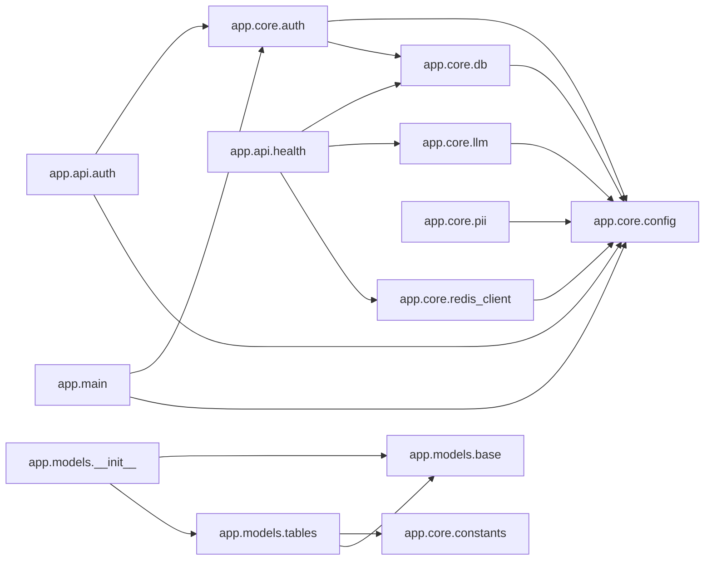

# Vachan.ai — CODEMAP (auto-generated)

> **Do not edit by hand.** Regenerate with `python3 tools/codewiki/build.py`.
> An AI-readable map of the whole backend: every module's purpose, its
> public classes/functions, and how modules depend on each other.
> Ask questions against it with `tools/codewiki/ask.py` (see that file).

_Generated 2026-06-27 18:42 • 18 modules • 1255 lines._

## Module dependency graph

## Modules

### `app.__init__`
_backend/app/__init__.py · 2 lines_

Vachan.ai backend application package.

### `app.api.__init__`
_backend/app/api/__init__.py · 2 lines_

HTTP route handlers.

### `app.api.auth`
_backend/app/api/auth.py · 51 lines_

Auth routes.

**Depends on:** `app.core.auth`, `app.core.config`

- **class `DevTokenRequest`(BaseModel)** — 

- **class `TokenResponse`(BaseModel)** — 

- **class `MeResponse`(BaseModel)** — 

- `def dev_token(req: DevTokenRequest) -> TokenResponse` — 

- `def me(auth: AuthContext=Depends(get_current_auth)) -> MeResponse` — 

### `app.api.health`
_backend/app/api/health.py · 35 lines_

GET /health — Phase-0 Definition of Done.

**Depends on:** `app.core.db`, `app.core.llm`, `app.core.redis_client`

- `async def health() -> dict[str, str]` — 

### `app.channels.__init__`
_backend/app/channels/__init__.py · 8 lines_

Channel Layer — Layer 1 adapters. Intentionally empty in Phase 0.

### `app.core.__init__`
_backend/app/core/__init__.py · 2 lines_

Core: config, constants, db, redis, auth, pii, llm — the shared plumbing.

### `app.core.auth`
_backend/app/core/auth.py · 168 lines_

Authentication — VERIFY tokens; never hand-roll production issuance (FD Part D).

**Depends on:** `app.core.config`, `app.core.db`

- **class `AuthContext`** — Who the verified caller is.

- **class `AuthError`(HTTPException)** — 
  - `def __init__(self, detail: str) -> None`

- `def assert_dev_auth_allowed() -> None` — Hard guard: the dev issuer/verifier must never run in production.

- `def issue_dev_token(user_id: str, org_id: str, email: str | None=None, role: str='member', ttl_seconds: int=3600) -> str` — Mint a local HS256 JWT for testing. DEV ONLY — guarded against production.

- `def verify_token(token: str) -> AuthContext` — 

- `async def get_current_auth(creds: HTTPAuthorizationCredentials=Depends(_bearer)) -> AuthContext` — FastAPI dependency: validate the Bearer token → AuthContext.

- `async def org_session(auth: AuthContext=Depends(get_current_auth)) -> AsyncIterator[AsyncSession]` — FastAPI dependency: an RLS-scoped DB session for the authenticated org.

### `app.core.config`
_backend/app/core/config.py · 70 lines_

Application settings, loaded from environment / `.env`.

- **class `Settings`(BaseSettings)** — 
  - `def is_production(self) -> bool`

- `def get_settings() -> Settings` — Cached singleton so we parse the environment exactly once.

### `app.core.constants`
_backend/app/core/constants.py · 123 lines_

Project-wide constants — the single source of truth for values that must

### `app.core.db`
_backend/app/core/db.py · 103 lines_

Database engine + the Row-Level Security (RLS) org-context helper.

**Depends on:** `app.core.config`

- `async def set_org_context(session: AsyncSession, org_id: UUID | str) -> None` — Pin this transaction to one org for RLS.

- `async def org_scoped_session(org_id: UUID | str) -> AsyncIterator[AsyncSession]` — Open a transaction already scoped to `org_id`. Every query inside sees

- `async def get_session() -> AsyncIterator[AsyncSession]` — FastAPI dependency for an UNSCOPED session (no org pinned yet).

- `async def ping_db() -> bool` — Health probe: returns True if a trivial query succeeds.

### `app.core.llm`
_backend/app/core/llm.py · 143 lines_

LiteLLM gateway — the single place that maps our model ALIASES to real,

**Depends on:** `app.core.config`

- `def get_router() -> Router` — Build the LiteLLM Router once. The Router gives us alias routing now and a

- `def alias_for_task(task_type: str) -> str` — FD-10: deterministic task-type → alias. Unknown tags fall to the default.

- `async def complete_with_alias(alias: str, messages: list[dict], **kwargs) -> Any` — Call a specific alias directly. Returns the raw LiteLLM response.

- `async def complete(task_type: str, messages: list[dict], **kwargs) -> Any` — Route by explicit task tag (FD-10), then call the chosen model.

- `def gateway_status() -> str` — Cheap health signal for /health — does NOT make a billed model call.

- `async def smoke(alias: str) -> str` — Make ONE real (billed) call through the gateway to the given alias and

- `async def smoke_completion() -> str` — Phase-0 Anthropic DoD: route a test prompt to Sonnet (needs Anthropic key).

### `app.core.pii`
_backend/app/core/pii.py · 186 lines_

PII sanitizer — RULE 6: this runs BEFORE any data reaches any model.

**Depends on:** `app.core.config`

- **class `SanitizationResult`** — Outcome of a sanitize() call.

- `def sanitize(text: str, entities: list[str] | None=None, score_threshold: float=0.4) -> SanitizationResult` — Redact PII from `text`, replacing each detected span with `[ENTITY_TYPE]`.

- `def redact(text: str) -> str` — Convenience: return only the redacted text.

### `app.core.redis_client`
_backend/app/core/redis_client.py · 26 lines_

Redis client (async) + health probe.

**Depends on:** `app.core.config`

- `async def ping_redis() -> bool` — Health probe: returns True if Redis answers PING.

### `app.main`
_backend/app/main.py · 34 lines_

FastAPI application factory.

**Depends on:** `app.core.auth`, `app.core.config`

- `def create_app() -> FastAPI` — 

### `app.models.__init__`
_backend/app/models/__init__.py · 29 lines_

ORM models package. Importing this registers every table on Base.metadata.

**Depends on:** `app.models.base`, `app.models.tables`

### `app.models.base`
_backend/app/models/base.py · 10 lines_

SQLAlchemy declarative base. All ORM models inherit from this.

- **class `Base`(DeclarativeBase)** — Shared metadata for every table. Alembic reads Base.metadata.

### `app.models.tables`
_backend/app/models/tables.py · 254 lines_

SQLAlchemy ORM models for all Phase-0 tables (PRD §9 + FD overrides).

**Depends on:** `app.core.constants`, `app.models.base`

- **class `Org`(Base)** — Root entity for multi-tenancy. One row per business/contestant/customer.

- **class `User`(Base)** — A person within an org. A data principal under the DPDP Act.

- **class `Consent`(Base)** — DPDP consent grant — one row per (data_type, purpose). Required before ingest.

- **class `Persona`(Base)** — A named communication identity. One user may own several.

- **class `PersonaObservation`(Base)** — One writing sample per row. THE most important table. APPEND-ONLY:

- **class `StyleVector`(Base)** — The style fingerprint per observation (mStyleDistance, dim = STYLE_VECTOR_DIM).

- **class `PersonaCapsule`(Base)** — Versioned persona snapshot. APPEND-ONLY (NO-UPDATE rule in the migration).

- **class `Conversation`(Base)** — Session-level container linking a user, a persona+capsule version, a channel.

- **class `Message`(Base)** — One turn in a conversation. `pfs_score` is the most granular fidelity data.

- **class `AuditLog`(Base)** — Immutable audit trail. NO UPDATE, NO DELETE ever (enforced in the migration).

### `app.tone.__init__`
_backend/app/tone/__init__.py · 9 lines_

Tone Engine — Layer 3 (the core IP). Intentionally empty in Phase 0.

## Conceptual docs (the 'why')

The `/docs` wiki explains intent; this CODEMAP explains the code. Pair them.

- [`00_START_HERE.md`](../00_START_HERE.md) — 00 — START HERE (Operating Manual for All Agents)
- [`01_PRD.md`](../01_PRD.md) — 01 — Product Requirements (PRD)
- [`02_ARCHITECTURE.md`](../02_ARCHITECTURE.md) — 02 — System Architecture
- [`03_TONE_ENGINE.md`](../03_TONE_ENGINE.md) — 03 — The Tone Engine (THE CORE — Opus-only territory)
- [`04_TECH_STACK.md`](../04_TECH_STACK.md) — 04 — Tech Stack (every tool, what it does, WHERE to get it)
- [`05_CHANNEL_LAYER.md`](../05_CHANNEL_LAYER.md) — 05 — Channel Layer (omnichannel adapters + MCP universal connector)
- [`06_UIUX_DESIGN.md`](../06_UIUX_DESIGN.md) — 06 — UI/UX Design System (Sandy + Coral)
- [`07_DATA_MODEL.md`](../07_DATA_MODEL.md) — 07 — Data Model
- [`08_HINGLISH.md`](../08_HINGLISH.md) — 08 — Hinglish & Code-Switching (the make-or-break for India)
- [`09_PRIVACY_LEGAL.md`](../09_PRIVACY_LEGAL.md) — 09 — Privacy, Consent & Legal (a GATE, not a feature)
- [`10_BUILD_PHASES.md`](../10_BUILD_PHASES.md) — 10 — Build Phases (what to build, in what order)
- [`11_VANDE_BHARATAM.md`](../11_VANDE_BHARATAM.md) — 11 — Vande Bharatam Flagship Demo & Selection Pitch
- [`12_FINAL_DECISIONS.md`](../12_FINAL_DECISIONS.md) — 12 — FINAL DECISIONS (the tiebreaker — binding)
- [`GLOSSARY.md`](../GLOSSARY.md) — GLOSSARY — Plain-English definitions
- [`PRD_FULL.md`](../PRD_FULL.md) — Vachan.ai — Master Project Document
- [`_critic_review_archived.md`](../_critic_review_archived.md) — Vachan.ai Wiki — Critic Review
